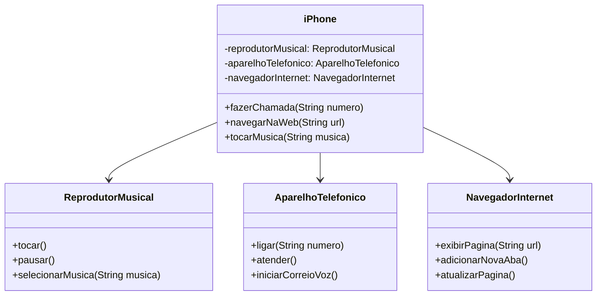
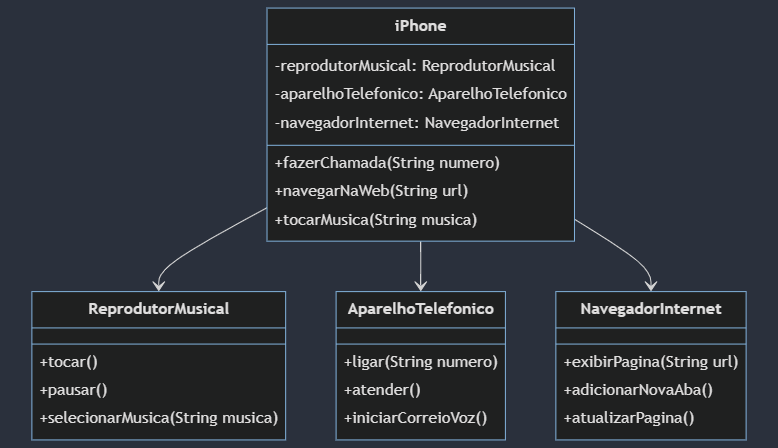

```mermaid
classDiagram
    class iPhone {
        -reprodutorMusical: ReprodutorMusical
        -aparelhoTelefonico: AparelhoTelefonico
        -navegadorInternet: NavegadorInternet
        +fazerChamada(String numero)
        +navegarNaWeb(String url)
        +tocarMusica(String musica)
    }

    class ReprodutorMusical {
        +tocar()
        +pausar()
        +selecionarMusica(String musica)
    }

    class AparelhoTelefonico {
        +ligar(String numero)
        +atender()
        +iniciarCorreioVoz()
    }

    class NavegadorInternet {
        +exibirPagina(String url)
        +adicionarNovaAba()
        +atualizarPagina()
    }

    iPhone --> ReprodutorMusical
    iPhone --> AparelhoTelefonico
    iPhone --> NavegadorInternet
```

